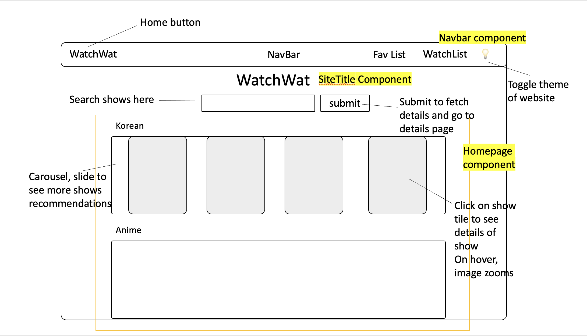
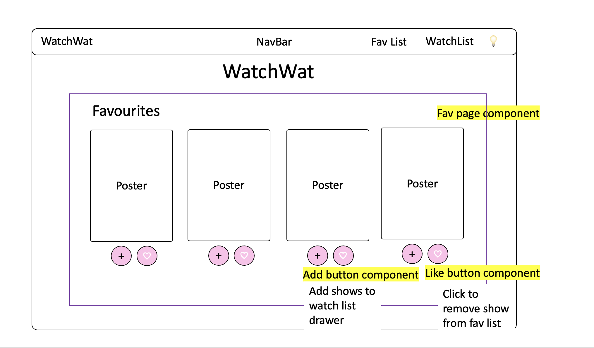
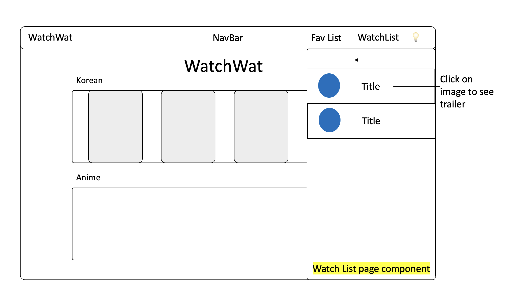
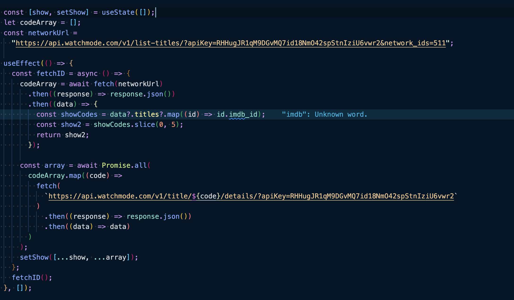

# Watchwat

### Project Brief

#### MVP - Minimum Viable Product

Build a web application using create-react-app / vite or next.js. Must be your own work.
Use React framework to build your application with at least

- 3 components
- 4 props
- 2 state properties
- 2 setState
- 2 routes
- Use 3rd party API and/or Firestore
- API call with Axios and display the data for the user. You may use any API of your choosing.
  Craft a README.md file that explains your app to the world.
  Create wire frames for your app and include it in your repo/readme.

### Technologies and Tools Used

- React
- Tailwind CSS
- Watch Mode API
- Insomnia

### Description

A mock up of Netflix where you can search for shows and movies, track the shows you are currently watching and store them in your favorites' list. For users who prefer the light mode, you can toggle the themes of the webpages using the toggle theme button on the Nav bar.

### WireFrames

Having clarity on the project progress is important as there are many components and states. Therefore, doing up a detailed wire frames help to identify the components and states needed and a DOM to help with the passing of props, states and information.

### Crux of project

The crux of this project is finding the right API and manipulating the data received. To find the right API, understanding the API is very important. After looking through several APIs, I noted that the different search inputs return different types of show data. Hence, the crux is to be able to use the different search queries and manipulate the results to return a set of data that is usable for the website.

For the website, there will be recommended shows by genres and the API results for the search genre returns only the brief details of the show data. I have to retrieve the id of the shows from the genre data and store it in an array. Then, use the array to do another fetch for the detailed show information.

### APIs used

Watch Mode API: https://api.watchmode.com/
